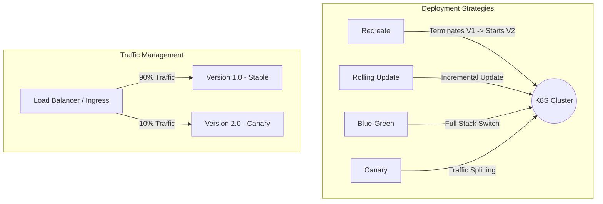

# 🚀 Kubernetes Deployment Strategies Masterclass

[](https://kubernetes.io/)
[](https://www.docker.com/)
[](https://opensource.org/licenses/MIT)

A comprehensive repository demonstrating industry-standard Kubernetes deployment strategies. This project provides hands-on manifests and configurations to master zero-downtime deployments, canary releases, and progressive delivery in a production-like environment using `KIND` (Kubernetes in Docker).

---

## 🏗️ Architecture Overview

The following diagram illustrates the various deployment strategies implemented in this repository:



---

## 🛠️ Implemented Strategies

| Strategy | Description | Zero Downtime | Pros | Cons |
| :--- | :--- | :---: | :--- | :--- |
| **Recreate** | Terminate all V1 pods before starting V2. | ❌ | Simple, no version conflict. | Downtime exists. |
| **Rolling Update** | Gradually replaces V1 pods with V2 pods. | ✅ | Default, low risk. | Slow rollout, two versions coexist. |
| **Blue-Green** | Deploy V2 alongside V1, then switch traffic. | ✅ | Instant rollback, full testing in prod. | Double resource cost. |
| **Canary** | Release V2 to a subset of users first. | ✅ | Error detection, performance monitoring. | Complex traffic routing. |

> [!TIP]
> For a more detailed breakdown, check our **[Deployment Strategies Comparison Guide](./deployment-strategies-comparison.md)**.

---

## 🛠️ Tech Stack & Tools

- **Orchestration**: Kubernetes (K8s)
- **Local Development**: KIND (Kubernetes in Docker)
- **Containerization**: Docker
- **Traffic Management**: Nginx Ingress Controller
- **Language/Framework**: Demo applications (Go/Python/Node.js)

---

## 📂 Project Structure

```bash
.
├── Blue-green-deployment/       # Blue-Green strategy manifests
├── Canary-deployment/           # Advanced Canary with Ingress
├── Recreate-deployment/         # Recreate strategy examples
├── Rolling-Update-Deployment/    # Default K8S update strategy
├── Simple-Canary-Example/       # Basic label-based canary
├── kind-cluster/                # Local KIND setup scripts
└── kind-config.yml              # Multi-node KIND configuration
```

---

## 🚀 Getting Started

### Prerequisites
- [Docker](https://docs.docker.com/get-docker/)
- [kubectl](https://kubernetes.io/docs/tasks/tools/)
- [KIND](https://kind.sigs.k8s.io/docs/user/quick-start/)

### 1. Setup KIND Cluster
Create a multi-node cluster to simulate a real-world environment:
```bash
kind create cluster --config kind-config.yml --name devops-lab
```

### 2. Deploy a Strategy (Example: Canary)
```bash
# Navigate to canary directory
cd Canary-deployment

# Apply manifests
kubectl apply -f canary-namespace.yml
kubectl apply -f canary-v1-deployment.yaml
kubectl apply -f canary-combined-service.yaml

# Roll out canary version
kubectl apply -f canary-v2-deployment.yaml
```

---

## 📊 Monitoring & Validation

To observe the deployment behavior in real-time, use:
```bash
# Watch pods rollout
kubectl get pods -n <namespace> -w

# Check service traffic distribution (for Canary)
while true; do curl -s http://localhost/api | grep "version"; sleep 0.5; done
```

---

## 🤝 Contributing

Contributions are welcome! Please follow these steps:
1. Fork the Project
2. Create your Feature Branch (`git checkout -b feature/AmazingFeature`)
3. Commit your Changes (`git commit -m 'Add some AmazingFeature'`)
4. Push to the Branch (`push origin feature/AmazingFeature`)
5. Open a Pull Request

---

## 📄 License

Distributed under the MIT License. See `LICENSE` for more information.

---

## 👨‍💻 Author

**Bittu Sharma**
- GitHub: [@bittush8789](https://github.com/bittush8789)
- Portfolio: [DevOps Portfolio](https://bittullmops.vercel.app/)

---
*Created with ❤️ for the DevOps Community.*
